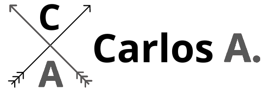
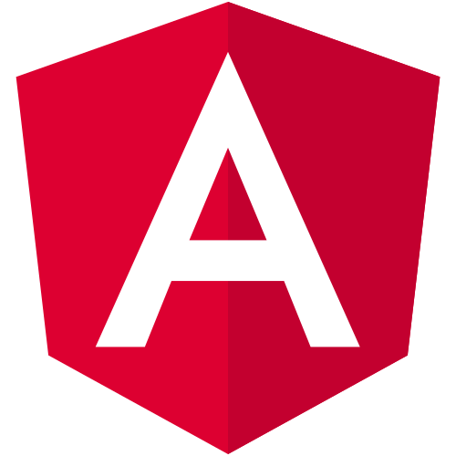

### Hi there 👋, I am Carlos.
## I'm a Systems Engineer!

- 💻 I’m currently working as a software developer.
- 🛠 I have experience in software design and development.
- 🎯 Life goals: Learn something new every day.

### Explore my portfolio or Linkedin:

[][portfolio]
[][linkedin]

 

### Technologies:

 
 

[portfolio]: https://www.carlosaguirre.tech/
[linkedin]: linkedin.com/in/carlos-andrés-aguirre-cañas-33612b134
